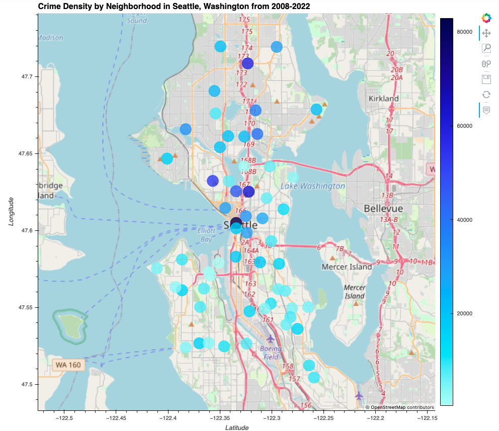
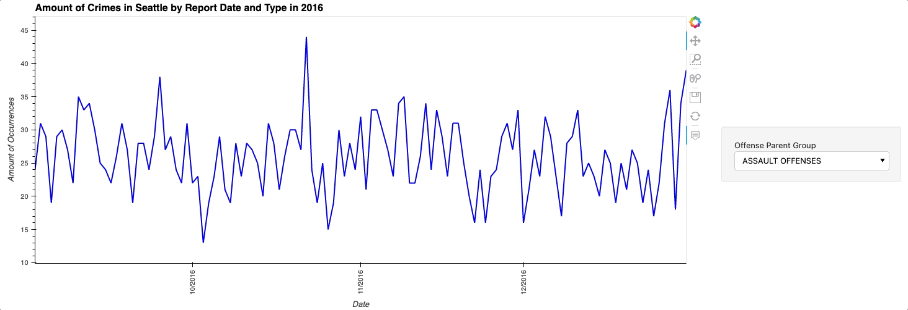
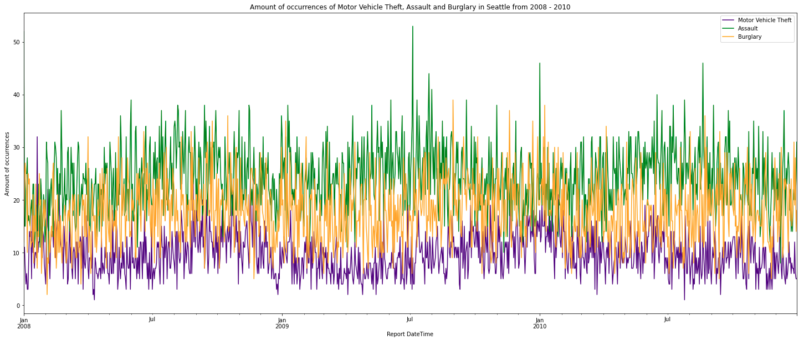
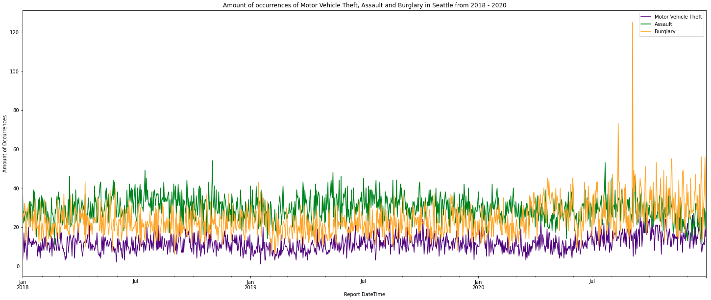
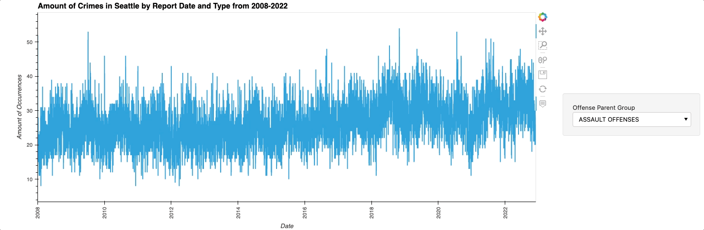
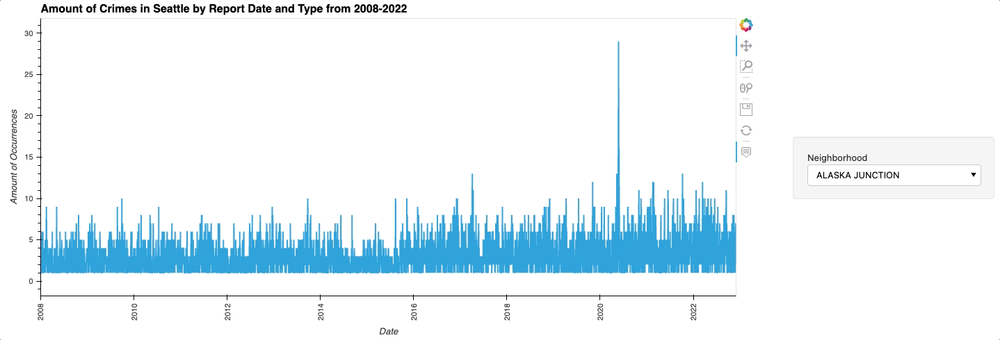
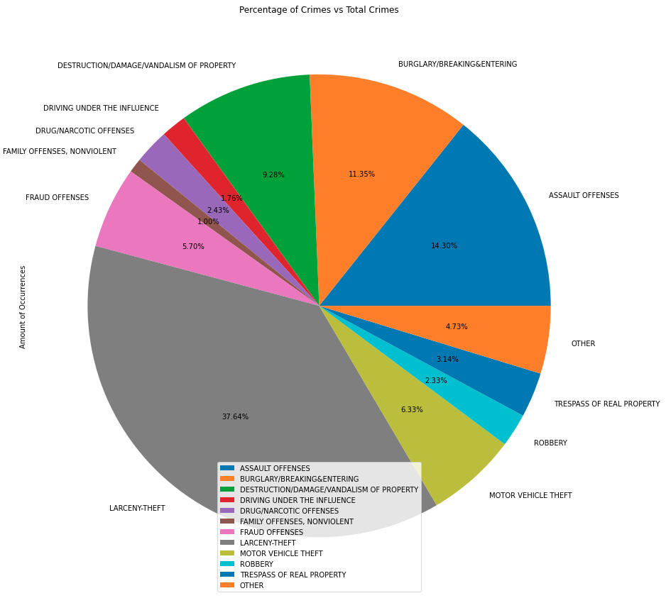

# Seattle Crime Analysis


## Description

  This jupyter notebook `main.pynb` file is an analysis of Seattle, Washington's crime data from the police department from 2008 through 2022. This project was developed to identify crime trends by date and by neighborhood. One can access total crime data and/or specific crimes, in the whole city and/or specific neighborhoods. This project was also created to identify changes in crime trends over time. Developers used `.csv` files along with many pandas libraries to clear and view graphs of the data. A new user could upload their own data and use these calculations to analyze it.

  

  The notebook allows the user to access different timeframes like 2008, 2012, 2016 and 2020. When focusing on these individual years, the user can see a graph during these years of the types of crimes and see how particular crimes change seasonally or with current events.  An example is below focusing on the year 2016.

  

  Additionally, the notebook has graphs that overlay plots over the same timeframes. We took a look at two timeframes in particular: 2008-2010 and 2018-2020.
  You can see both timeframes and their respective graphs below.

  

  

  While the user is able to look in to certain timeframes, this notebook offers other capabilities like looking at crime data over time. The user can view this data using an interactive plot to understand crime by type and their respective quantities over time.

  

  The user is also able to view total crimes per neighborhood in an interactive plot.

  

  Finally, the user is able to understand by analyzing a pie chart what percentage each type of crime in comparison to total crimes has taken place in Seattle from 2008-2022.

  

  By combining all of these different views and data, the user can start to make some of their own conclusions and analyze what has gone on in Seattle and in the world over time. Some examples that we were able to find are:

  1. When examining crime by type over time, "Bad Checks" hit its prime around 2010. Nowadays in 2022, there are few crimes for bad checks because checks have been phased out of society. In its place, we now have mobile services like Venmo, Zelle, and Cashapp that allow for instant transfers.
  2. When examining crime by type over time, "Burglary" and "Assault" spiked to incredible numbers in the summer of 2020. If we take a look at current events at this time, COVID was in full force and so was the Capitol Hill Autonomous Zone (CHAZ). During this period, citizens patrolled the streets and broke into most businesses in the area, which spiked these categories numbers.
  3. When examining the pie chart, we can see that over time larceny-theft, assault, and burglary are the most common crimes.


## Table of Contents

- [Seattle Crime Analysis](#seattle-crime-analysis)
  - [Description](#description)
  - [Table of Contents](#table-of-contents)
  - [1. Installation](#1-installation)
  - [2. Usage](#2-usage)
  - [3. License](#3-license)
  - [4. Contributing](#4-contributing)
  - [5. Tests](#5-tests)
  - [6. Deployment](#6-deployment)
  - [7. Contact](#7-contact)


## 1. Installation

  If you would like to clone the repository, type "git clone https://github.com/kheller18/seattle-crime-analysis.git".
  In the terminal, with the conda dev environment activated, install the following packages and dependencies before running the crime analysis application. To understand how to install these, refer to the [Usage](#2-usage)

  * [csv](https://docs.python.org/3/library/csv.html) - Used to store all of our SPD data

  * [Jupyter Lab](https://jupyterlab.readthedocs.io/en/stable/) - *version 3.4.4* - Used to create and share documents that contain live code, equations, visualizations and narrative text.

  * [matplotlib](https://matplotlib.org/) - For the visualization of crime data.

  * [pandas](https://pandas.pydata.org/docs/) - For the analysis of crime data.

  * [pathlib](https://docs.python.org/3/library/pathlib.html) - *version 1.0.1* - This was used to locate through the directory or file path.

  * [PyVizlot](https://pyviz.org/) -  Python visualization package that provides a single platform for accessing multiple visualization libraries. Our most heavily used library is:

    * [hvplot.pandas](https://hvplot.holoviz.org/user_guide/Introduction.html) - *version 0.7.2* - For the interactive visualization of the crime data.

  * [Voilà](https://github.com/voila-dashboards/voila) - This will allow us to view our crime analysis on the web browser.


## 2. Usage

  After cloning the repository locally, you'll need to have the packages listed in [Installation](#1-installation) installed on your machine. To do so, you'll need to activate your conda dev environment and running the following commands:

      ```
      pip install pandas
      pip install hvplot
      pip install jupyterlab
      conda install -c pyviz hvplot
      conda install -c voila
      conda list nodejs

      ```

  After all of these are installed, please refer to the [Deployment](#6-deployment) section for instructions on how to view or edit the notebook.


## 3. License

	MIT License

  Copyright (c) 2022 Keenan Heller | Olga Ortega | Audell Sabeti | Ariana Moreno | Rachel Hodson

  Permission is hereby granted, free of charge, to any person obtaining a copy
  of this software and associated documentation files (the "Software"), to deal
  in the Software without restriction, including without limitation the rights
  to use, copy, modify, merge, publish, distribute, sublicense, and/or sell
  copies of the Software, and to permit persons to whom the Software is
  furnished to do so, subject to the following conditions:

  The above copyright notice and this permission notice shall be included in all
  copies or substantial portions of the Software.

  THE SOFTWARE IS PROVIDED "AS IS", WITHOUT WARRANTY OF ANY KIND, EXPRESS OR
  IMPLIED, INCLUDING BUT NOT LIMITED TO THE WARRANTIES OF MERCHANTABILITY,
  FITNESS FOR A PARTICULAR PURPOSE AND NONINFRINGEMENT. IN NO EVENT SHALL THE
  AUTHORS OR COPYRIGHT HOLDERS BE LIABLE FOR ANY CLAIM, DAMAGES OR OTHER
  LIABILITY, WHETHER IN AN ACTION OF CONTRACT, TORT OR OTHERWISE, ARISING FROM,
  OUT OF OR IN CONNECTION WITH THE SOFTWARE OR THE USE OR OTHER DEALINGS IN THE
  SOFTWARE.


## 4. Contributing

  + [Keenan Heller](https://github.com/kheller18)
  + [Olga Ortega](https://github.com/olgaortega5)
  + [Audell Sabeti](https://github.com/asabeti)
  + [Ariana Moreno](https://github.com/arianamoreno13)
  + [Rachel Hodson](https://github.com/rachelannhodson)


## 5. Tests

  + There are currently no tests associated with this project.


## 6. Deployment
  + There is currently no live deployment of this notebook on a common server, but the user has the ability to run this notebook locally on their machine via two different ways:
    + `Jupyter Lab`: Navigate to the root directory and type "jupyter lab main.ipynb"
    + `Voilà`: Navigate to the root directory and type "voila main.ipynb"


## 7. Contact

  + [Keenan's LinkedIn](https://www.linkedin.com/in/keenanheller/)
  + [Olga's LinkedIn](https://www.linkedin.com/in/olga-ortega-82a15329)
  + [Audell's LinkedIn](https://www.linkedin.com/in/audell-sabeti-38375a1b2)
  + [Ariana's LinkedIn](www.linkedin.com/in/ariana-moreno-52b2b7211)
  + [Rachel's LinkedIn](https://www.linkedin.com/in/rachelannhodson/)
